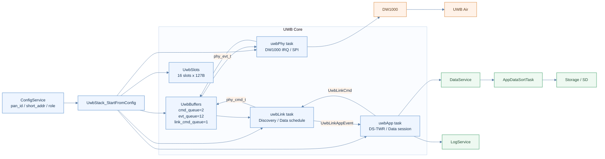
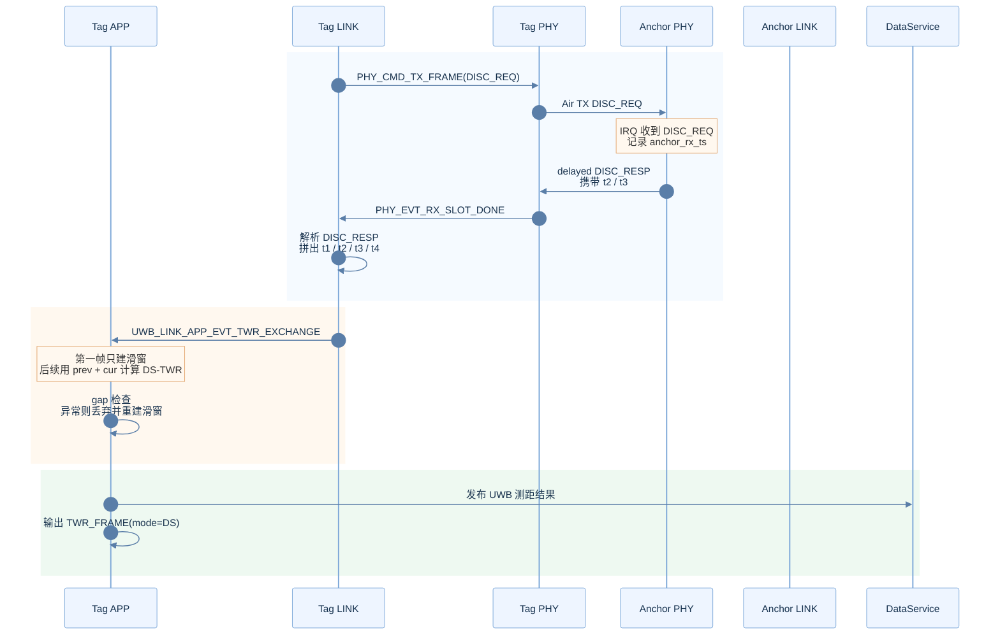
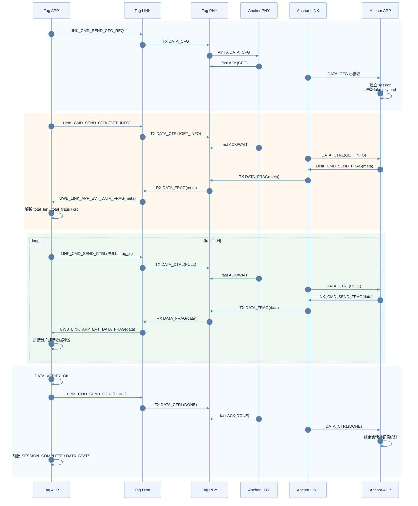

# UWB 系统框图与底层流程

本文描述当前工程中 `APP/UWB` 这一条链路，重点覆盖：

- 测距帧：`DISC_REQ / DISC_RESP / TWR_EXCHANGE / TWR_FRAME`
- 数据帧：`DATA_CFG / DATA_CTRL / DATA_FRAG / DATA_ACK`
- 三层结构：`PHY / LINK / APP`
- 共享资源：`queue / slot / DataService`

对应实现文件：

- `APP/UWB/uwb_stack.c`
- `APP/UWB/uwb_buffers.c/.h`
- `APP/UWB/uwb_slots.c/.h`
- `APP/UWB/uwb_phy.c/.h`
- `APP/UWB/uwb_link.c/.h`
- `APP/UWB/uwb_app.c/.h`

## 1. 总体框图

## 2. 模块职责

| 模块 | 线程 | 主要输入 | 主要输出 | 职责 |
|---|---|---|---|---|
| `uwbPhy` | `uwbPhy` | `phy_cmd_t` | `phy_evt_t` | 直接控制 DW1000，收发帧，处理中断，构造快速应答 |
| `uwbLink` | `uwbLink` | `phy_evt_t`、`UwbLinkCmd` | `phy_cmd_t`、`UwbLinkAppEvent` | 调度 Discovery、多槽接收、数据帧发送和上报 |
| `uwbApp` | `uwbApp` | `UwbLinkAppEvent` | `UwbLinkCmd`、`AppDataNode`、日志 | 测距结果生成、数据会话状态机、结果发布 |
| `UwbSlots` | 共享池 | 多线程访问 | `uwb_slot_t *` | 帧数据零拷贝共享区，队列只传索引 |
| `UwbBuffers` | 共享队列 | 多线程访问 | 队列消息 | PHY / LINK / APP 间的小消息通道 |

## 3. 共享资源

| 资源 | 定义位置 | 大小 | 作用 |
|---|---|---:|---|
| `cmd_queue` | `uwb_buffers.c` | 2 | `LINK -> PHY` 发送命令 |
| `evt_queue` | `uwb_buffers.c` | 12 | `PHY -> LINK` 上报事件 |
| `link_cmd_queue` | `uwb_buffers.c` | 1 | `APP -> LINK` 下发数据会话命令 |
| `g_app_evt_queue` | `uwb_link.c` | 8 | `LINK -> APP` 上报测距与数据事件 |
| `slot_pool` | `uwb_slots.c` | 16 个 slot | 帧缓存、时间戳、质量信息、分片元数据 |

`slot` 的 owner 流转规则：

- `UWB_SLOT_FREE`：空闲，可重新分配
- `UWB_SLOT_LINK_OWN`：LINK 正在构造待发帧
- `UWB_SLOT_PHY_OWN`：PHY 持有，正在接收或刚接收完成
- `UWB_SLOT_APP_OWN`：APP 为数据分片预装载 payload

## 4. 测距帧底层流程

### 4.1 图形化时序图

### 4.2 关键步骤

1. `uwbLink` 在 Tag 侧空闲时周期性发 `DISC_REQ`。
2. `uwbPhy` 发出 `DISC_REQ` 后立即打开多槽 RX 窗口。
3. Anchor 侧 `uwbPhy` 在 IRQ 上下文中直接构造 `DISC_RESP`，并按地址映射到回复槽。
4. Tag 侧 `uwbLink` 从 `DISC_RESP` 中取出 `anchor_rx_ts` 与 `anchor_tx_ts`，再结合本地 `tag_tx_ts`、`tag_rx_ts` 拼成 `UwbTwrExchange`。
5. `uwbApp` 使用滑窗法计算 `DS-TWR`：
   - 第一帧只记录为 `prev`
   - 第二帧及以后用 `prev + cur` 计算一次 `DS`
6. 当前实现只发布 `DS` 结果，不再输出 `SS` 结果。

### 4.3 当前测距恢复策略

当前 `uwb_app.c` 的逻辑不是 `DS -> SS` 退化，而是：

- 首帧：只建滑窗，日志为 `TWR_DBG_WAIT_PAIR`
- `DS` 计算失败：丢弃当前结果，日志为 `TWR_DBG_DS_DROP ... reason=compute`
- `DS` 计算成功但与上一条已发布结果时间差超过 `12ms`：丢弃当前结果，日志为 `TWR_DBG_DS_DROP ... reason=gap`
- 丢弃后把当前帧记为新的滑窗起点，下一帧重新尝试 `DS`

这意味着当前系统的恢复方式是：

- 不做 `SS-TWR` 距离发布
- 通过重建滑窗恢复 `DS-TWR`

## 5. 数据帧底层流程

### 5.1 当前假数据

Anchor 侧当前内置假数据由 `uwb_app.c` 中的 5 句字符串拼接而成：

- 总长度：`230 bytes`
- 分片大小：`62 bytes`
- 总分片数：`4`
- 实际分片：`62 + 62 + 62 + 44`

### 5.2 图形化时序图

### 5.3 数据帧命令顺序

Tag 侧 APP 的会话顺序是：

1. `DATA_SESSION_START`
2. `DATA_CFG`
3. `DATA_ACK CFG`
4. `GET_INFO`
5. `DATA_META`
6. `PULL frag=1..N`
7. `DATA_FRAG frag=1..N`
8. `DATA_VERIFY_OK`
9. `DONE`
10. `DATA_ACK DONE`
11. `SESSION_COMPLETE / DATA_STATS`

Anchor 侧 APP 的响应顺序是：

1. 收到 `DATA_CFG`
2. 初始化 session 和 payload
3. `GET_INFO` 时发送 `meta`
4. `PULL` 时发送对应 `data frag`
5. `DONE / STOP` 时结束会话并记录统计

## 6. 当前实现中的关键点

### 6.1 测距与数据复用同一条空口

- 数据帧与测距帧共用同一个 DW1000 和同一套 `PHY / LINK / APP` 线程
- 数据会话期间，Tag 侧 `uwbLink` 会在 Discovery / Data 之间调度
- 因此数据会话会拉高 `TWR` 帧间隔，但不会改变测距公式本身

### 6.2 测距结果的发布时间基准

当前 `TWR_FRAME` 的时间基准是：

- `DS` 结果：`prev.tag_rx_local_tick_20k` 与 `cur.tag_rx_local_tick_20k` 的平均值
- 超时或异常：当前结果直接丢弃，不输出 `SS`

### 6.3 典型日志与含义

| 日志 | 含义 |
|---|---|
| `TWR_FRAME mode=DS ...` | 成功发布了一条 `DS-TWR` 结果 |
| `TWR_DBG_WAIT_PAIR ...` | 当前帧只用于建立滑窗，不发布结果 |
| `TWR_DBG_GAP ... gap_ok=0` | 本次 `DS` 候选结果与上一条已发布结果间隔过大 |
| `TWR_DBG_DS_DROP ... reason=gap` | 因时间间隔超阈值，丢弃当前结果并重建滑窗 |
| `TWR_DBG_DS_DROP ... reason=compute` | `DS` 公式失败，丢弃当前结果并重建滑窗 |
| `DATA_SESSION_START ...` | Tag 侧发起一轮数据会话 |
| `DATA_META ... total_frags=4` | Anchor 返回本轮数据元信息 |
| `DATA_FRAG frag=n ...` | 收到第 `n` 个数据分片 |
| `SESSION_COMPLETE ...` | Tag 侧本轮数据会话完成 |

## 7. 一句话总结

当前 UWB 子系统是标准的三层结构：

- `PHY` 负责 DW1000 收发和快速应答
- `LINK` 负责 Discovery、数据帧调度和事件汇总
- `APP` 负责 `DS-TWR` 滑窗测距和数据会话状态机

测距与数据传输共用同一条空口。当前测距发布路径已经收敛为：

- 只发布 `DS-TWR`
- 出现异常时丢弃当前结果
- 以当前帧为新滑窗起点，在下一帧恢复测距
