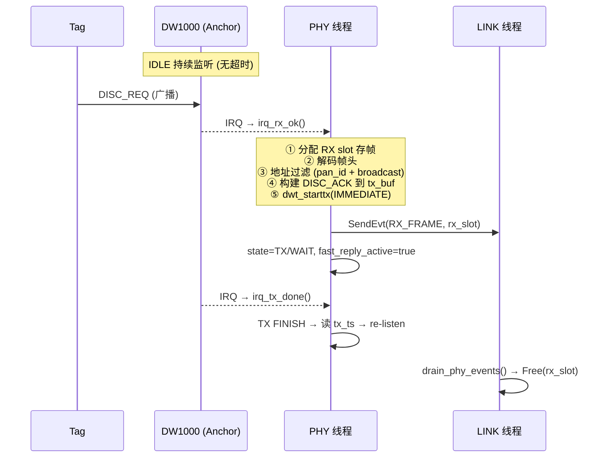
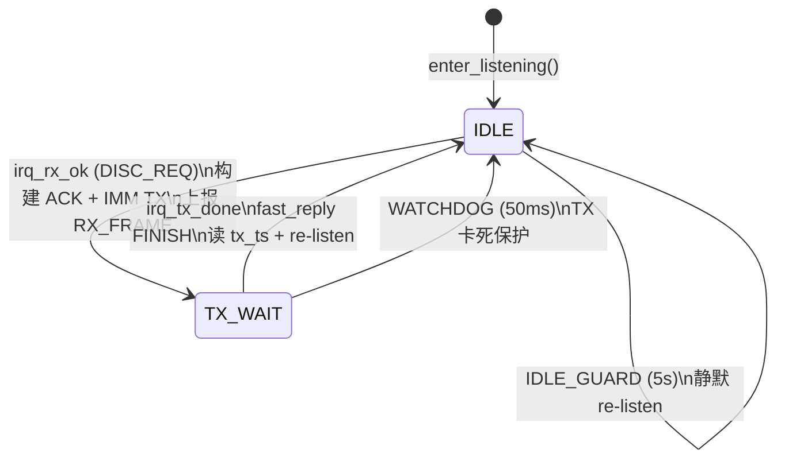

# Anchor 侧发现帧最小环路代码结构

## 当前 Anchor 实时应答流程



## 是否需要调整？

### ✅ 不需要调整的部分

| 项 | 原因 |
|----|------|
| **快速应答使用 `tx_buf`** | 不占用 slot pool，没有回收问题 |
| **RX slot 由 LINK 回收** | LINK 需要读帧数据（src_short 等），读完回收是合理的 |
| **PHY 状态机流程** | IDLE→irq_rx_ok→TX/WAIT→TX FINISH→re-listen，链路清晰 |
| **50ms 看门狗** | 覆盖快速应答 TX 等待（< 1ms），正常不会触发 |

### ⚠️ 需要注意的问题

| 项 | 问题 | 建议 |
|----|------|------|
| **SPI 全 F 防护** | 和 Tag 相同，`0xFFFFFFFF` 会误触发 irq_rx_ok 读垃圾数据 | 加 SPI 健康检查 |
| **EXTI 中断丢失** | 和 Tag 相同，POLL_CATCH 50ms 延迟导致应答慢 | 共性问题，需排查硬件 |
| **LINK 层基本空转** | Anchor 的 LINK 只做 drain_phy_events + osDelay(50ms) | 可以接受，极简设计 |

## Anchor 代码结构总览

### 层次分工

```
┌─────────────────────────────────────────────────┐
│  LINK 线程 (Anchor)                              │
│  ┌───────────────────────────────────────────┐   │
│  │ for (;;) {                                │   │
│  │     drain_phy_events();  // 回收 RX slot  │   │
│  │     osDelay(50);         // 被动等待      │   │
│  │ }                                         │   │
│  └───────────────────────────────────────────┘   │
│  不发送任何命令给 PHY, 不分配 TX slot             │
└─────────────────────────────────────────────────┘
         ↑ PHY_EVT_RX_FRAME (slot_index)
         │
┌─────────────────────────────────────────────────┐
│  PHY 线程 (Anchor) - 所有收发都在这里完成        │
│                                                  │
│  IDLE: enter_listening() → 持续 RX 无超时        │
│    ↓ IRQ: RXFCG                                  │
│  irq_rx_ok():                                    │
│    ├─ 分配 RX slot (UWB_SLOT_PHY_OWN)           │
│    ├─ SPI 读帧 → slot.data                      │
│    ├─ 解码帧头 + 地址过滤                        │
│    ├─ 判断: DISC_REQ?                            │
│    │   ├─ YES: 构建 ACK → tx_buf                │
│    │   │       dwt_starttx(IMMEDIATE)            │
│    │   │       SendEvt(RX_FRAME) → LINK          │
│    │   │       state=TX/WAIT                     │
│    │   └─ NO:  SendEvt(RX_FRAME) → LINK          │
│    │           re-listen                          │
│    ↓                                              │
│  TX/WAIT → irq_tx_done() → TX FINISH            │
│    ├─ fast_reply_active=true → 读 tx_ts          │
│    └─ re-listen                                  │
└─────────────────────────────────────────────────┘
         ↑ EXTI (DW1000 IRQ)
         │
┌─────────────────────────────────────────────────┐
│  DW1000 硬件                                     │
│  持续 RX → 收到帧 → RXFCG 中断                  │
│  发送 ACK → TXFRS 中断                           │
└─────────────────────────────────────────────────┘
```

### Anchor PHY 状态转换



### Anchor 关键代码位置

| 功能 | 文件 | 位置 |
|------|------|------|
| 快速应答判断 + ACK 构建 | `uwb_phy.c` | `irq_rx_ok()` L219-246 |
| ACK 帧编码 | `uwb_phy.c` | `build_fast_reply_ack()` L141-158 |
| 快速应答 TX FINISH | `uwb_phy.c` | `TX STEP_FINISH` L462-472 |
| RX slot 回收 | `uwb_link.c` | `drain_phy_events()` → `PHY_EVT_RX_FRAME` |
| LINK 主循环 | `uwb_link.c` | `UwbLink_Task()` → Anchor 分支只 drain + delay |

### Anchor 内存使用

| 资源 | 用途 | 备注 |
|------|------|------|
| `g_phy.tx_buf[127]` | ACK 帧数据 | 不占 slot pool |
| slot pool (8 个) | 仅用于 RX | PHY 分配, LINK 回收 |
| cmd_queue | **不使用** | Anchor LINK 不发命令 |
| evt_queue | RX_FRAME 事件 | PHY → LINK |

## 与 Tag 侧的差异对比

| 项 | Tag | Anchor |
|----|-----|--------|
| 主动发送 | LINK 分配 slot + SendCmd | **不主动发送** |
| TX slot 来源 | slot pool (LINK 分配) | `tx_buf` (PHY 内部) |
| TX slot 回收 | PHY 回收 | 无需回收 (不占 slot) |
| RX slot 回收 | LINK 回收 | LINK 回收 (相同) |
| LINK 行为 | 定时发 DISC_REQ + 等待 | 只做 drain + delay |
| 超时保护 | LINK 50ms 等待 + PHY 50ms 看门狗 | PHY 50ms 看门狗 |
| 消息队列使用 | cmd_queue + evt_queue | 仅 evt_queue |

## 结论

**Anchor 侧当前的实时应答架构不需要调整**，原因:

1. 快速应答在 PHY 层内闭环完成（rx_ok → 构建 ACK → IMM TX → tx_done → re-listen），不涉及跨线程 slot 传递
2. ACK 使用 `tx_buf` 而非 slot pool，没有回收问题
3. LINK 层只负责回收 RX slot，职责单一清晰
4. 50ms 看门狗覆盖了 TX 卡死的情况

唯一共性问题是 **EXTI 中断丢失** 和 **SPI 0xFFFFFFFF**，这是 Tag 和 Anchor 共同面对的硬件层问题，不影响本次代码架构。
