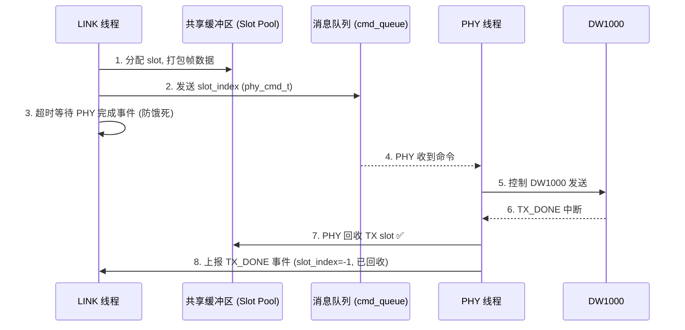

# 重构 UWB 发送阶段数据槽生命周期

## 问题背景

当前发送阶段的数据槽（slot）存在泄漏：LINK 层分配 slot 后通过命令队列发给 PHY，但 **TX_DONE 事件回到 LINK 时由 LINK 负责回收 slot**，如果事件丢失或 LINK 处理不及时，slot 就永远无法释放。

## 新逻辑概要



### 关键变更

1. **TX slot 由 PHY 回收**：PHY 在 TX FINISH 阶段直接 `UwbSlots_Free(tx_slot)`，然后上报 `TX_DONE` 事件时 `slot_index = -1`（已回收标记）
2. **LINK 层超时保护**：LINK 发送命令后使用 `xTaskNotifyWait` 带超时等待，超时后放弃本轮（slot 已不归 LINK 管，由 PHY 兜底回收）
3. **ACK 帧使用独立内部 tx_buf**：Anchor 快速应答继续使用 `g_phy.tx_buf`，不占用 slot pool
4. **移除 LINK 层 1s 看门狗**：不再有 `link_watchdog()` 和 `LINK_PHY_ALIVE_MS`
5. **保留 PHY RESET 代码**：`PHY_CMD_RESET` 逻辑保留在代码中但 LINK 不再主动调用

## Proposed Changes

---

### Slot 回收逻辑变更

#### [MODIFY] [uwb_phy.c](file:///c:/Users/fefe/Desktop/vscodepro/UWB/APP/UWB/uwb_phy.c)

**TX FINISH 阶段** (约 L460-496)：
```diff
 case UWB_PHY_STEP_FINISH: {
     /* 快速应答完成 (不变) */
     if (g_phy.fast_reply_active) { ... }

     /* 填 TX 时间戳到 slot */
     uwb_slot_t *s = UwbSlots_Get(g_phy.tx_slot);
     if (s != NULL) {
         s->tx_ts = UwbPhy_ReadTxTimestamp();
     }

-    /* 上报 TX_DONE */
-    phy_evt_t evt = { .type = PHY_EVT_TX_DONE, .slot_index = g_phy.tx_slot };
+    /* PHY 层直接回收 TX slot */
+    if (g_phy.tx_slot >= 0) {
+        UwbSlots_Free(g_phy.tx_slot);
+    }
+
+    /* 上报 TX_DONE (slot 已回收, index=-1) */
+    phy_evt_t evt = { .type = PHY_EVT_TX_DONE, .slot_index = -1 };
     UwbBuffers_SendEvt(&evt, 0);

     if (g_phy.pending_rx) {
         /* 进入 RX_SLOT 等待应答 */
         ...
     } else {
-        g_phy.tx_slot = -1;
+        g_phy.tx_slot = -1;  /* 标记已释放 */
         enter_listening();
     }
```

**PHY 看门狗** (约 L656-678)：同样由 PHY 回收 tx_slot：
```diff
 /* 释放占用的 slot */
 if (g_phy.tx_slot >= 0) {
-    phy_evt_t evt = { .type = PHY_EVT_ERROR, .slot_index = g_phy.tx_slot };
+    UwbSlots_Free(g_phy.tx_slot);
+    phy_evt_t evt = { .type = PHY_EVT_ERROR, .slot_index = -1 };
     UwbBuffers_SendEvt(&evt, 0);
     g_phy.tx_slot = -1;
 }
```

**TX PREPARE 失败路径** (约 L434-449)：PHY 在 TX 失败时也直接回收：
```diff
 app_log_warn("[PHY] TX_DELAY_FAIL");
-phy_evt_t evt = { .type = PHY_EVT_ERROR, .slot_index = g_phy.tx_slot };
+UwbSlots_Free(g_phy.tx_slot);
+phy_evt_t evt = { .type = PHY_EVT_ERROR, .slot_index = -1 };
 UwbBuffers_SendEvt(&evt, 0);
 g_phy.tx_slot = -1;
```

---

#### [MODIFY] [uwb_link.c](file:///c:/Users/fefe/Desktop/vscodepro/UWB/APP/UWB/uwb_link.c)

**1. 移除 `link_watchdog()` 和 `LINK_PHY_ALIVE_MS`**

**2. LINK 层 `drain_phy_events()` 中 TX_DONE 不再回收 slot**：
```diff
 case PHY_EVT_TX_DONE: {
-    uwb_slot_t *s = UwbSlots_Get(evt.slot_index);
-    if (s != NULL) {
-        app_log_info("[LINK] TX_DONE win=%u ...", ...);
-    }
-    if (evt.slot_index >= 0) UwbSlots_Free(evt.slot_index);
+    app_log_info("[LINK] TX_DONE (slot recycled by PHY)");
     break;
 }
```

**3. `link_tag_send_disc()` 增加超时机制**：LINK 发送命令后等待 PHY 的 TX_DONE/ERROR 事件，带超时保护：
```diff
-    UwbPhy_NotifyCmd();
-    g_link.cmd_pending = true;
-    g_link.last_phy_evt_ms = HAL_GetTick();
+    UwbPhy_NotifyCmd();
+
+    /* 超时等待 PHY 处理完成 (通过 evt_queue 轮询) */
+    phy_evt_t evt;
+    bool got = UwbBuffers_RecvEvt(&evt, pdMS_TO_TICKS(LINK_TX_TIMEOUT_MS));
+    if (got) {
+        app_log_info("[LINK] TX result: type=%u", (unsigned)evt.type);
+    } else {
+        app_log_warn("[LINK] TX timeout, slot owned by PHY");
+    }
```

**4. 主循环简化**：移除 watchdog 调用，LINK 在每轮 `link_tag_send_disc()` 中已内含等待

**5. 新增超时参数**：
```c
#define LINK_TX_TIMEOUT_MS  50U   /* 等待 PHY 处理 TX 的最大时间 */
```

---

#### [MODIFY] [uwb_phy.h](file:///c:/Users/fefe/Desktop/vscodepro/UWB/APP/UWB/uwb_phy.h)

移除 `UWB_PHY_IDLE_GUARD_MS` (1s 保护超时)，仅保留活跃态看门狗：
```diff
 #define UWB_PHY_WATCHDOG_MS            5U
-#define UWB_PHY_IDLE_GUARD_MS          1000U
+#define UWB_PHY_IDLE_GUARD_MS          5000U  /* 放宽到 5s, 仅防止硬件彻底卡死 */
```

> [!NOTE]
> `UWB_PHY_IDLE_GUARD_MS` 不删除，只放宽。IDLE 状态的 guard 只是防止 DW1000 接收机彻底卡死，与业务无关。

---

### PHY 线程不变部分

PHY 线程的主循环结构、IRQ 处理、状态机、Anchor 快速应答逻辑全部保持不变。只修改 TX FINISH 和错误路径中 slot 的回收时机。

---

## 变更总结

| 项 | 旧行为 | 新行为 |
|----|--------|--------|
| TX slot 回收 | LINK 在 `drain_phy_events()` 中回收 | **PHY 在 TX FINISH 直接回收** |
| TX_DONE 事件 | 携带 `slot_index` | `slot_index = -1` (已回收标记) |
| LINK 等待 | 50ms `osDelay` 轮询 | `UwbBuffers_RecvEvt` 带 50ms 超时阻塞 |
| 1s 看门狗 | LINK 监控 PHY 活性，超时发 RESET | **移除** |
| PHY RESET 代码 | LINK 主动调用 | **保留代码，不再调用** |
| ACK 帧 slot | 使用 `g_phy.tx_buf` (不占 slot) | **不变** |
| PHY IDLE guard | 1s | 放宽到 5s |

## Verification Plan

### 编译验证
- `eide build` 确保无编译错误

### 日志验证 (硬件上)
- 确认 `[LINK] TX_DONE (slot recycled by PHY)` 出现
- 确认不再出现 `[LINK] no slot for TX` (slot 泄漏已修复)
- 确认 `[LINK] TX timeout` 不会频繁出现
- 确认 Anchor 快速应答仍正常工作

## Open Questions

> [!IMPORTANT]
> **RX slot 的回收**：当前 RX slot 仍由 LINK 在 `drain_phy_events()` 的 `PHY_EVT_RX_FRAME` 分支回收。是否也改为 PHY 回收？建议暂时保持现状，因为 LINK 可能需要读取 RX slot 中的帧数据做业务处理，读完再回收是合理的。

> [!NOTE]
> **PHY ERROR 事件中的 slot_index**：改为 -1 后 LINK 不再需要回收。LINK 只需记录错误日志。
