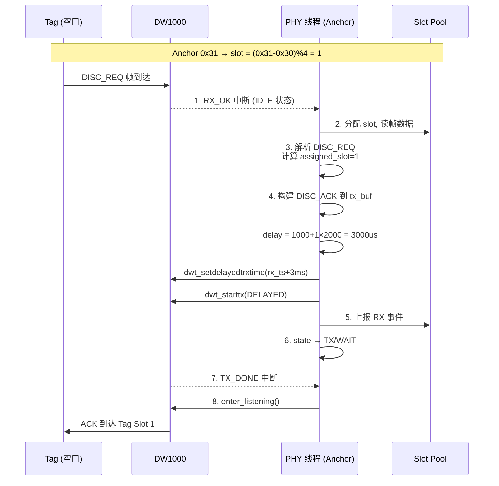

# 多槽接收方案 V2 - Anchor 侧

> 创建时间: 2026-05-11
> 修订时间: 2026-05-11 (统一 DELAYED TX, 修正时序图)
> Tag 侧见: [多槽接收方案-v2-Tag.md](多槽接收方案-v2-Tag.md)

## 1. 概述

| 参数 | 值 |
|------|-----|
| RX 槽数量 | 4 (Tag 侧) |
| 每槽宽度 | 2ms |
| 槽分配公式 | `(short_addr - 0x30) % 4` |
| Anchor 地址范围 | 0x30 ~ 0x3F (16 个) |

---

## 2. 延迟应答机制

### 2.1 槽分配公式

```c
#define ANCHOR_ADDR_BASE       0x30U
#define DISC_RX_SLOT_COUNT     4U
#define ANCHOR_REPLY_GUARD_US  1000U   /* 最小处理时间保护 (1ms) */
#define DISC_SLOT_WIDTH_US     2000U   /* 每槽 2ms */

uint8_t assigned_slot = (g_phy.short_addr - ANCHOR_ADDR_BASE) % DISC_RX_SLOT_COUNT;
```

| Anchor short_addr | `(addr - 0x30) % 4` | 回复槽 |
|---|---|---|
| 0x30 | 0 | Slot 0 |
| 0x31 | 1 | Slot 1 |
| 0x32 | 2 | Slot 2 |
| 0x33 | 3 | Slot 3 |
| 0x34 | 0 | Slot 0 (碰撞) |

### 2.2 延迟 TX 实现

修改 `irq_rx_ok()` 中 Anchor 快速应答部分:

> **设计决策**: 所有 slot (包括 slot 0) 统一使用 DELAYED TX。
> 原因: IMMEDIATE TX 存在竞态风险 — Anchor 处理极快时 ACK 可能在 Tag
> `dwt_rxenable()` 之前到达导致丢帧。统一 DELAYED 消除此风险,
> delay ≥ 1ms 在 DW1000 上可靠 (之前 < 500µs 的不可靠问题不再适用)。

```c
if (g_phy.role == APP_ROLE_ANCHOR &&
    frame.common.func_code == (uint8_t)UWB_FUNC_DISCOVERY_REQ) {

    uint8_t assigned_slot = (g_phy.short_addr - ANCHOR_ADDR_BASE)
                             % DISC_RX_SLOT_COUNT;

    g_phy.tx_buf_len = build_fast_reply_ack(frame.mac.src16, frame.mac.seq);
    if (g_phy.tx_buf_len > 0) {
        dwt_writetxdata(g_phy.tx_buf_len + 2U, g_phy.tx_buf, 0);
        dwt_writetxfctrl(g_phy.tx_buf_len + 2U, 0);

        /* 所有 slot 统一使用 DELAYED TX, 消除 slot 0 竞态 */
        uint64_t rx_ts = s->rx_ts;
        uint32_t delay_us = ANCHOR_REPLY_GUARD_US
                            + assigned_slot * DISC_SLOT_WIDTH_US;
        uint64_t tx_time = rx_ts + UwbPhy_UsToDwTime(delay_us);
        dwt_setdelayedtrxtime((uint32_t)(tx_time >> 8));
        int ret = dwt_starttx(DWT_START_TX_DELAYED);

        if (ret == 0) {
            g_phy.fast_reply_active = true;
            app_log_info("[PHY] TX_STARTED fast_reply slot=%u delay=%luus",
                         (unsigned)assigned_slot, (unsigned long)delay_us);
            /* 上报 RX 事件 */
            phy_evt_t rx_evt = { .type = PHY_EVT_RX_FRAME,
                                  .slot_index = g_phy.rx_slot };
            UwbBuffers_SendEvt(&rx_evt, 0);
            g_phy.rx_slot = -1;
            g_phy.state = UWB_PHY_ST_TX;
            g_phy.step  = UWB_PHY_STEP_WAIT;
            g_phy.tx_slot = -1;
            g_phy.pending_rx = false;
            return;
        }
        app_log_warn("[PHY] TX_FAIL fast_reply slot=%u",
                     (unsigned)assigned_slot);
        g_phy.fast_reply_active = false;
    }
}
```

### 2.3 新增宏定义 (`uwb_phy.h`)

```c
#define DISC_SLOT_WIDTH_US       2000U
#define DISC_RX_SLOT_COUNT       4U
#define ANCHOR_ADDR_BASE         0x30U
#define ANCHOR_REPLY_GUARD_US    1000U   /* Anchor 回复最小延迟 */
```

---

## 3. 时序对齐分析

> **假设**: Tag 每两个 RX 槽之间有处理间隙 Δ ≈ 0.05~0.15ms
> (FINISH + PREPARE 步骤的 SPI/队列操作)。4 个槽累计漂移 3Δ ≈ 0.15~0.45ms。
> GUARD=1ms 提供 > 0.5ms 冗余, 足以覆盖此漂移。

```
Tag 时间线 (相对 TX_STARTED):
  t=0      : TX_STARTED
  t≈0.1ms  : TX_DONE → PHY 进入 RX_SLOT
  t≈0.1ms  : Slot 0 RX_ON  (0.1ms  ~ 2.1ms)
  t≈2.1+Δ  : Slot 1 RX_ON  (2.1+Δ  ~ 4.1+Δ)
  t≈4.1+2Δ : Slot 2 RX_ON  (4.1+2Δ ~ 6.1+2Δ)
  t≈6.1+3Δ : Slot 3 RX_ON  (6.1+3Δ ~ 8.1+3Δ)

Anchor 时间线 (相对自身 RX_OK ≈ Tag t=0):
  delay 公式: GUARD + slot × WIDTH (所有 slot 统一 DELAYED TX)
  assigned_slot=0: TX at rx_ts + 1ms     → 到达 Tag ≈ 1.0ms ∈ Slot 0 [0.1, 2.1]     ✓
  assigned_slot=1: TX at rx_ts + 3ms     → 到达 Tag ≈ 3.0ms ∈ Slot 1 [2.1+Δ, 4.1+Δ] ✓
  assigned_slot=2: TX at rx_ts + 5ms     → 到达 Tag ≈ 5.0ms ∈ Slot 2 [4.1+2Δ, 6.1+2Δ] ✓
  assigned_slot=3: TX at rx_ts + 7ms     → 到达 Tag ≈ 7.0ms ∈ Slot 3 [6.1+3Δ, 8.1+3Δ] ✓

安全约束: 3Δ < 0.9ms → Δ < 300µs/槽 (实测 < 150µs, 满足)
```

> ANCHOR_REPLY_GUARD_US=1000 提供充分余量 (实测 Anchor 处理 avg=0.2ms, max=1ms).

---

## 4. 风险点

1. **DW1000 延迟发送**: 之前注释说 "不可靠", 但那是 <500us 级别. 本方案 delay ≥ 1ms, 应可靠.
2. **同槽碰撞**: Anchor 数 > 4 时 `% 4` 会碰撞, 暂不处理.
3. **槽间漂移**: Tag 槽间处理间隙 Δ 累积后, Anchor ACK 需落在漂移后的窗口内. 当前 GUARD=1ms 余量足够 (Δ<300µs), 但如果将来在 FINISH/PREPARE 中增加耗时操作需重新评估.

---

## 5. 流程图

### 5.1 Anchor 延迟应答流程



### 5.2 多 Anchor 时序总览

```mermaid
gantt
    title Tag 多槽接收时序 (4 Anchors, 统一 DELAYED TX)
    dateFormat X
    axisFormat %L ms

    section Tag
    TX DISC_REQ           :tx, 0, 1
    RX Slot 0 (2ms)       :s0, 1, 3
    RX Slot 1 (2ms)       :s1, 3, 5
    RX Slot 2 (2ms)       :s2, 5, 7
    RX Slot 3 (2ms)       :s3, 7, 9

    section Anchor 0x30 (slot=0)
    RX + 处理             :a0r, 0, 1
    等待延迟              :a0w, 1, 2
    TX ACK (DELAYED 1ms)  :a0t, 2, 3

    section Anchor 0x31 (slot=1)
    RX + 处理             :a1r, 0, 1
    等待延迟              :a1w, 1, 4
    TX ACK (DELAYED 3ms)  :a1t, 4, 5

    section Anchor 0x32 (slot=2)
    RX + 处理             :a2r, 0, 1
    等待延迟              :a2w, 1, 6
    TX ACK (DELAYED 5ms)  :a2t, 6, 7

    section Anchor 0x33 (slot=3)
    RX + 处理             :a3r, 0, 1
    等待延迟              :a3w, 1, 8
    TX ACK (DELAYED 7ms)  :a3t, 8, 9
```


