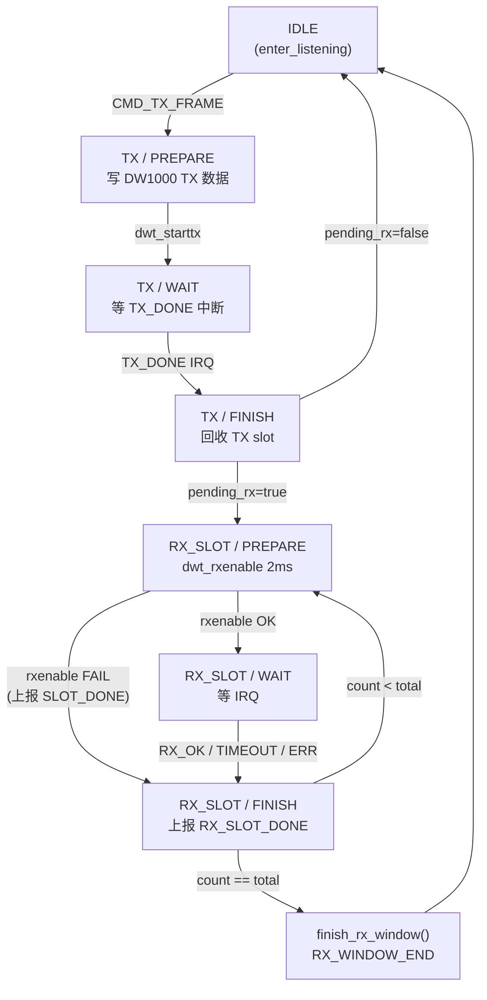

# 多槽接收方案 V2 - Tag 侧

> 创建时间: 2026-05-11
> 修订时间: 2026-05-11 (消除 goto, 补充漂移假设, 调整 evt_queue 深度)
> Anchor 侧见: [多槽接收方案-v2-Anchor.md](多槽接收方案-v2-Anchor.md)

## 1. 概述

| 参数 | 值 |
|------|-----|
| RX 槽数量 | 由 LINK 层通过 `cmd.rx_slot_count` 下发 (当前配 4) |
| 每槽超时 | 2ms (`UWB_PHY_RX_SLOT_TIMEOUT_US = 2000U`) |
| 汇总日志 | LINK 层在所有槽结束后输出 |
| SD 卡写入 | 暂时屏蔽 |

### 核心原则

- PHY 层: 每个槽结束后通过 evt_queue 通知 LINK (有帧传 slot_index, 无帧传 -1)
- PHY 层: 所有槽结束后发 `RX_WINDOW_END` 通知 LINK
- PHY 层: **不打日志** (减少串口开销)
- LINK 层: 收到 `RX_WINDOW_END` 后, 输出一条汇总日志

---

## 2. 消息队列修改 (`uwb_buffers.h`)

```c
typedef enum {
    PHY_EVT_TX_DONE = 0,
    PHY_EVT_RX_FRAME,         /* IDLE 收帧 (保留兼容) */
    PHY_EVT_RX_TIMEOUT,       /* 保留兼容 */
    PHY_EVT_RX_SLOT_DONE,     /* ★ 新增: 单个 RX 槽完成 */
    PHY_EVT_RX_WINDOW_END,    /* ★ 新增: 所有 RX 槽结束 */
    PHY_EVT_ERROR,
} phy_evt_type_t;

typedef struct {
    phy_evt_type_t type;
    int8_t slot_index;         /* 物理 slot index, -1 = 无帧 */
    uint8_t rx_seq;            /* ★ 新增: RX 时间槽序号 (0-3) */
} phy_evt_t;
```

> **evt_queue 深度**: 每个 TX+RX 窗口最多产生 6 个事件 (1×TX_DONE + 4×RX_SLOT_DONE + 1×RX_WINDOW_END)。
> 建议将 evt_queue 深度从 8 调整为 **12**, 防止 LINK 处理延迟导致事件丢失。

---

## 3. PHY 层 (`uwb_phy.c`)

### 3.1 上下文新增字段

```c
/* phy_context_t 新增: */
uint8_t  rx_frame_count;       /* 本窗口收到的有效帧总数 */
```

### 3.2 TX FINISH 进入 RX_SLOT 初始化

```c
if (g_phy.pending_rx) {
    g_phy.tx_slot        = -1;
    g_phy.rx_done_count  = 0;
    g_phy.rx_total_count = g_phy.pending_rx_count; /* 来自 LINK: cmd.rx_slot_count */
    g_phy.rx_got_frame   = false;
    g_phy.rx_slot        = -1;
    g_phy.rx_frame_count = 0;     /* ★ 新增 */
    g_phy.state = UWB_PHY_ST_RX_SLOT;
    g_phy.step  = UWB_PHY_STEP_PREPARE;
}
```

### 3.3 辅助函数: 窗口结束处理

> **设计决策**: 将窗口结束逻辑提取为独立函数, 避免 `goto` 跨 switch-case 跳转。

```c
/**
 * @brief 所有 RX 槽结束, 发 RX_WINDOW_END 并回到监听
 */
static void finish_rx_window(void)
{
    phy_evt_t end = { .type = PHY_EVT_RX_WINDOW_END,
                      .slot_index = -1,
                      .rx_seq = g_phy.rx_frame_count };
    UwbBuffers_SendEvt(&end, 0);
    enter_listening();
}
```

### 3.4 RX_SLOT 状态机 (核心改动)

```c
case UWB_PHY_STEP_PREPARE: {
    /* 清除残留 status */
    uint32_t residual = dwt_read32bitreg(SYS_STATUS_ID);
    uint32_t clr = residual & PHY_STATUS_CLEAR_MASK;
    if (clr) dwt_write32bitreg(SYS_STATUS_ID, clr);
    __HAL_GPIO_EXTI_CLEAR_IT(GPIO_PIN_8);

    dwt_setrxtimeout(g_phy.pending_rx_timeout_us);
    if (dwt_rxenable(0) != 0) {
        /* RX 启用失败: 当前槽标记为空, 上报 */
        phy_evt_t evt = { .type = PHY_EVT_RX_SLOT_DONE,
                          .slot_index = -1,
                          .rx_seq = g_phy.rx_done_count };
        UwbBuffers_SendEvt(&evt, 0);
        g_phy.rx_done_count++;
        if (g_phy.rx_done_count < g_phy.rx_total_count) {
            g_phy.step = UWB_PHY_STEP_PREPARE;
        } else {
            finish_rx_window();
        }
        break;
    }
    g_phy.step = UWB_PHY_STEP_WAIT;
    break;
}

case UWB_PHY_STEP_FINISH: {
    uint8_t seq = g_phy.rx_done_count;
    bool got = (g_phy.rx_got_frame && g_phy.rx_slot >= 0);

    if (got) {
        /* 有帧: 上报 slot_index + 序号 */
        phy_evt_t evt = { .type = PHY_EVT_RX_SLOT_DONE,
                          .slot_index = g_phy.rx_slot,
                          .rx_seq = seq };
        UwbBuffers_SendEvt(&evt, 0);
        g_phy.rx_slot = -1;
        g_phy.rx_frame_count++;
    } else {
        /* 空/超时/错误: 上报 -1 + 序号, 不分配物理 slot */
        phy_evt_t evt = { .type = PHY_EVT_RX_SLOT_DONE,
                          .slot_index = -1,
                          .rx_seq = seq };
        UwbBuffers_SendEvt(&evt, 0);
    }

    g_phy.rx_done_count++;
    g_phy.rx_got_frame = false;

    if (g_phy.rx_done_count < g_phy.rx_total_count) {
        g_phy.step = UWB_PHY_STEP_PREPARE;  /* 下一个 slot */
    } else {
        finish_rx_window();
    }
    break;
}
```

### 3.5 irq_rx_ok() - 去掉日志

```c
/* 删除: app_log_info("[PHY] RX_OK"); */
/* 删除: app_log_info("[PHY] RX_SLOT_ON"); */
/* PHY 层不再打任何逐槽日志, 全部由 LINK 汇总 */
```

---

## 4. LINK 层 (`uwb_link.c`)

### 4.1 修改 `link_tag_send_disc()`

槽数量由 LINK 层定义, PHY 层不硬编码:

```c
#define DISC_RX_SLOT_COUNT  4U   /* 槽数量, 唯一定义点 */

cmd.rx_slot_count  = DISC_RX_SLOT_COUNT;       /* → PHY: pending_rx_count → rx_total_count */
cmd.rx_timeout_us  = UWB_PHY_RX_SLOT_TIMEOUT_US;  /* 2ms/槽 */
```

> PHY 层通过 `g_phy.rx_total_count` 使用此值, 不关心具体数字.

### 4.2 LINK 层上下文新增

```c
typedef struct {
    // ... 现有字段 ...
    int8_t   rx_slot_results[DISC_RX_SLOT_COUNT]; /* ★ 新增: 记录每槽结果 */
} link_context_t;
```

### 4.3 修改 `drain_phy_events()` - 汇总日志

```c
static void drain_phy_events(void)
{
    phy_evt_t evt;
    while (UwbBuffers_RecvEvt(&evt, 0)) {
        switch (evt.type) {
            case PHY_EVT_TX_DONE:
                break;

            case PHY_EVT_RX_SLOT_DONE: {
                if (evt.rx_seq < DISC_RX_SLOT_COUNT) {
                    g_link.rx_slot_results[evt.rx_seq] = evt.slot_index;
                }
                /* 有帧: 立即处理帧数据 + 回收物理 slot */
                if (evt.slot_index >= 0) {
                    uwb_slot_t *s = UwbSlots_Get(evt.slot_index);
                    if (s != NULL) {
                        /* 按需处理帧数据 */
                    }
                    UwbSlots_Free(evt.slot_index);  /* ★ 立即回收 */
                }
                break;
            }

            case PHY_EVT_RX_WINDOW_END: {
                /* ★ 所有 RX 槽结束 - LINK 层输出汇总日志 */
                uint8_t ok_count = evt.rx_seq;  /* rx_seq 复用为收帧数 */
                app_log_info("[LINK] RX_WIN ok=%u/%u r=[%d,%d,%d,%d]",
                             (unsigned)ok_count,
                             (unsigned)DISC_RX_SLOT_COUNT,
                             (int)g_link.rx_slot_results[0],
                             (int)g_link.rx_slot_results[1],
                             (int)g_link.rx_slot_results[2],
                             (int)g_link.rx_slot_results[3]);
                /* 重置 */
                memset(g_link.rx_slot_results, -1,
                       sizeof(g_link.rx_slot_results));
                break;
            }

            case PHY_EVT_RX_FRAME: {
                /* IDLE 状态收帧 (保留兼容) */
                uwb_slot_t *s = UwbSlots_Get(evt.slot_index);
                if (s != NULL) {
                    app_log_info("[LINK] RX type=%u src=0x%04X",
                                 s->frame_type, s->src_short);
                }
                if (evt.slot_index >= 0) UwbSlots_Free(evt.slot_index);
                break;
            }

            case PHY_EVT_RX_TIMEOUT:
                app_log_info("[LINK] RX_TIMEOUT");
                break;

            case PHY_EVT_ERROR:
                app_log_warn("[LINK] PHY_ERROR");
                break;
        }
    }
}
```

---

## 5. SD 卡屏蔽 (`log_service.c`)

```c
#define LOG_SERVICE_SD_ENABLED  (0U)

/* LogService_VWrite 中: */
#if LOG_SERVICE_SD_ENABLED
    (void)AppTasks_LogWriteSd(line, bounded_strlen(line, sizeof(line)));
#endif
```

---

## 6. 文件修改清单

| 文件 | 改动 |
|------|------|
| `uwb_buffers.h` | 新增 `PHY_EVT_RX_SLOT_DONE`, `PHY_EVT_RX_WINDOW_END`; `phy_evt_t` 增加 `rx_seq`; evt_queue 深度 8→12 |
| `uwb_phy.c` | 新增 `finish_rx_window()`; RX_SLOT 状态机: 每槽上报事件, 不打日志; `phy_context_t` 新增 `rx_frame_count` |
| `uwb_link.c` | `rx_slot_count=4`; LINK 汇总日志; `link_context_t` 新增 `rx_slot_results[4]`; `drain_phy_events` 新增 SLOT_DONE/WINDOW_END 处理 |
| `log_service.c` | `LOG_SERVICE_SD_ENABLED (0U)` 屏蔽 SD 写入 |

---

## 7. 流程图

### 7.1 Tag TX + 多槽 RX 流程

```mermaid
sequenceDiagram
    participant LINK as LINK 线程
    participant POOL as Slot Pool
    participant EVT as evt_queue
    participant PHY as PHY 线程
    participant DW as DW1000

    Note over LINK,DW: ═══ TX 阶段 ═══
    LINK->>PHY: cmd_queue: TX_FRAME (rx_slot_count=N)
    PHY->>DW: dwt_starttx()
    DW-->>PHY: TX_DONE 中断
    PHY->>POOL: 回收 TX slot
    PHY->>EVT: TX_DONE

    Note over LINK,DW: ═══ RX 窗口 (N×2ms) ═══

    rect rgb(230, 245, 255)
        Note over PHY,DW: ── Slot 0 (2ms) ──
        PHY->>DW: rxenable(timeout=2ms)
        alt 收到帧
            DW-->>PHY: RX_OK 中断
            PHY->>POOL: 分配 slot, 读帧数据
            PHY->>EVT: RX_SLOT_DONE (seq=0, slot=N)
            EVT->>LINK: 处理帧数据 + 立即回收 slot
        else 超时
            DW-->>PHY: TIMEOUT 中断
            PHY->>EVT: RX_SLOT_DONE (seq=0, slot=-1)
            Note right of EVT: 不分配物理 slot
        end
    end

    Note over PHY,DW: ── Slot 1 ~ N-1 (同上) ── ...

    Note over LINK,DW: ═══ 窗口结束 ═══
    PHY->>PHY: finish_rx_window()
    PHY->>EVT: RX_WINDOW_END (rx_seq=收帧总数)
    EVT->>LINK: 汇总日志: [LINK] RX_WIN ok=1/N r=[...]
```

### 7.2 PHY 状态机


