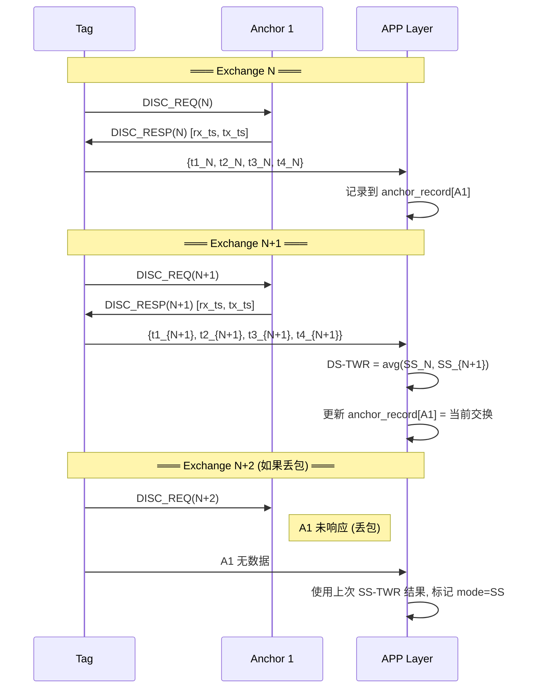

# 滑窗 TWR 测距方案 V3

> 创建时间: 2026-05-11
> 基于: plan-v2 多槽接收方案

## 1. 概述

### 核心思想

**不引入独立测距帧**，复用现有 DISC_REQ / DISC_RESP 交换，通过在 APP 层滑窗组合相邻两次交换的时间戳实现 DS-TWR。

### 设计原则

| 原则 | 说明 |
|------|------|
| PHY 层无感知 | PHY 不知道上层做 TWR，只负责收发帧 + 读写时间戳 |
| LINK 层连续发射 | 去掉 200ms 周期，连续发送 DISC_REQ |
| APP 层计算距离 | 滑窗组合 DS-TWR，丢包自动退化 SS-TWR |
| 数据帧不打断 | DATA 帧等当前 DISC 交换完成后再发 |

### 频率评估

| 场景 | 单次交换耗时 | DS-TWR 频率 | 说明 |
|------|------------|------------|------|
| 纯测距 | ~11ms | ~90 Hz | 每次交换产出一次 DS-TWR |
| 偶尔数据帧 | ~11ms | ~60-72 Hz | 跨 DATA 的 pair 无效 |
| 频繁数据帧 | ~22ms/pair | ~45 Hz | 每2次交换出1次有效 |
| 丢包退化 | ~11ms | SS-TWR ~90 Hz | 仅精度降低，频率不变 |

---

## 2. Phase 1: Anchor DISC_RESP 携带时间戳

> **这是 plan-v3 的基础，必须首先实现。**

### 2.1 当前问题

当前 `build_fast_reply_ack()` 构建的 DISC_RESP 是空壳帧：

```c
// 当前代码 (uwb_phy.c:164-165)
frame.common.ext_header_len = 0;   // ← 没有扩展头
frame.common.payload_len    = 0;   // ← 没有负载
```

且构建顺序有问题：**先构建帧 → 再计算 tx_time**，导致无法将 tx_time 嵌入帧中。

### 2.2 DISC_RESP 新帧结构

```
┌─────────────────────────────────────────────────────┐
│ MAC Header (9B) │ Common Header (6B) │ Ext Header (10B) │
│                 │                     │                   │
│ frame_ctrl[2]   │ proto_ver           │ rx_ts[5]  ← Anchor 收到 DISC_REQ 的时间戳 │
│ seq             │ func_code=0x21      │ tx_ts[5]  ← Anchor 延迟发送的预计算时间戳 │
│ pan_id          │ flags               │                   │
│ dst16           │ ext_header_len=10   │                   │
│ src16           │ payload_len=0       │                   │
└─────────────────────────────────────────────────────┘

总帧长: 9 + 6 + 10 = 25 字节 (原 15 字节)
空口时间增加: 可忽略不计 (~几十µs)
```

### 2.3 修改 `build_fast_reply_ack()` 签名

```c
/**
 * @brief 构建 DISC_RESP 快速应答帧 (携带 TWR 时间戳)
 * @param dst_short  目标地址 (Tag)
 * @param seq        帧序号
 * @param rx_ts      Anchor 收到 DISC_REQ 的 RX 时间戳 (5-byte DW1000 格式)
 * @param tx_ts      Anchor 预计算的 TX 时间戳 (5-byte DW1000 格式)
 * @return 帧长度, 0=失败
 */
static uint16_t build_fast_reply_ack(uint16_t dst_short, uint8_t seq,
                                     uint64_t rx_ts, uint64_t tx_ts)
{
    UwbProtocolFrame frame;
    UwbProtocol_InitFrame(&frame,
                          &g_phy.stack_cfg,
                          dst_short,
                          seq,
                          UWB_FUNC_DISCOVERY_RESP);

    /* ★ 新增: 携带 TWR 时间戳 */
    frame.common.ext_header_len = 10;
    frame.common.payload_len    = 0;

    /* rx_ts: Anchor 收到 DISC_REQ 的时间 (5 bytes LE) */
    UwbProtocol_WriteLe32(&frame.ext_header[0], (uint32_t)(rx_ts & 0xFFFFFFFF));
    frame.ext_header[4] = (uint8_t)(rx_ts >> 32);

    /* tx_ts: Anchor 延迟发送的预计算时间 (5 bytes LE) */
    UwbProtocol_WriteLe32(&frame.ext_header[5], (uint32_t)(tx_ts & 0xFFFFFFFF));
    frame.ext_header[9] = (uint8_t)(tx_ts >> 32);

    size_t tx_len = 0;
    if (!UwbProtocol_Encode(&frame, g_phy.tx_buf,
                            sizeof(g_phy.tx_buf), &tx_len)) {
        return 0;
    }
    return (uint16_t)tx_len;
}
```

### 2.4 修改 `irq_rx_ok()` 中的调用顺序

**关键改动**：先计算 tx_time，再构建帧，最后写入 DW1000。

```c
/* ---- Anchor 快速应答: 收到 DISC_REQ 时延迟发送 ACK ---- */
if (g_phy.role == APP_ROLE_ANCHOR &&
    frame.common.func_code == (uint8_t)UWB_FUNC_DISCOVERY_REQ) {

    uint8_t assigned_slot = (g_phy.short_addr - ANCHOR_ADDR_BASE) % DISC_RX_SLOT_COUNT;

    /* ★ 先计算延迟发送时间 */
    uint64_t rx_ts    = s->rx_ts;
    uint32_t delay_us = ANCHOR_REPLY_GUARD_US + assigned_slot * DISC_SLOT_WIDTH_US;
    uint64_t tx_time  = rx_ts + UwbPhy_UsToDwTime(delay_us);

    /* ★ 再构建帧 (携带 rx_ts 和 tx_time) */
    g_phy.tx_buf_len = build_fast_reply_ack(frame.mac.src16, frame.mac.seq,
                                            rx_ts, tx_time);
    if (g_phy.tx_buf_len > 0) {
        /* 写帧数据到 DW1000 */
        dwt_writetxdata(g_phy.tx_buf_len + 2U, g_phy.tx_buf, 0);
        dwt_writetxfctrl(g_phy.tx_buf_len + 2U, 0);

        /* 设置延迟发送 */
        dwt_setdelayedtrxtime((uint32_t)(tx_time >> 8));
        int ret = dwt_starttx(DWT_START_TX_DELAYED);
        // ... 后续逻辑不变 ...
    }
}
```

> **注意**: `tx_time` 是 DW1000 40-bit 时间戳格式，`dwt_setdelayedtrxtime` 接收高 32 位 (>> 8)。
> 嵌入帧中的是完整 40-bit 值。DW1000 delayed TX 的实际发射时间精度在 ~15ps 以内，
> 因此预计算值可以直接作为精确 TX 时间戳使用。

### 2.5 Tag 侧解析 (LINK 层)

Tag 收到 DISC_RESP 后，从 ext_header 中提取 Anchor 的时间戳：

```c
/* drain_phy_events() → RX_SLOT_DONE 处理 */
if (evt.slot_index >= 0) {
    uwb_slot_t *s = UwbSlots_Get(evt.slot_index);
    if (s != NULL && s->frame_type == UWB_FUNC_DISCOVERY_RESP) {
        /* 解析帧获取 Anchor 时间戳 */
        UwbProtocolFrame frame;
        if (UwbProtocol_Decode(&frame, s->data, s->data_len) &&
            frame.common.ext_header_len >= 10) {

            uint64_t anchor_rx_ts = UwbProtocol_ReadLe32(&frame.ext_header[0])
                                  | ((uint64_t)frame.ext_header[4] << 32);
            uint64_t anchor_tx_ts = UwbProtocol_ReadLe32(&frame.ext_header[5])
                                  | ((uint64_t)frame.ext_header[9] << 32);

            /* 组合本地时间戳: tag_tx_ts, tag_rx_ts = s->rx_ts */
            /* 上报给 APP 层做 TWR 计算 */
        }
    }
    UwbSlots_Free(evt.slot_index);
}
```

---

## 3. Phase 2: LINK 层连续测距模式

> Phase 1 完成验证后再实施。

### 3.1 去掉固定周期

```c
// 当前: LINK_DISC_PERIOD_MS = 200ms (5Hz)
// 改为: 上一次 DISC 交换完成后立即发送下一次
```

LINK 层改为事件驱动：收到 `RX_WINDOW_END` 后立即触发下一次 `DISC_REQ`。

### 3.2 数据帧排队

```c
typedef struct {
    // ... 现有字段 ...
    bool     disc_exchange_active;    /* 当前是否在 DISC 交换中 */
    bool     data_frame_pending;      /* 有数据帧等待发送 */
} link_context_t;

/* 调度逻辑 */
void link_tag_schedule(void) {
    if (g_link.disc_exchange_active) {
        return;  /* DISC 交换进行中，不打断 */
    }

    if (g_link.data_frame_pending) {
        link_tag_send_data();        /* 优先发数据帧 */
        g_link.data_frame_pending = false;
    }

    link_tag_send_disc();            /* 然后继续 DISC */
}
```

### 3.3 Tag TX 时间戳记录

当前 TX slot 被 PHY 回收后 `tx_ts` 就丢失了。需要在 LINK 层记录：

```c
typedef struct {
    uint16_t window_id;
    uint64_t tag_tx_ts;     /* Tag 发送 DISC_REQ 的时间 */
} link_disc_record_t;

/* 在 TX_DONE 事件处理时, 从 slot 读取 tx_ts 后再回收 */
```

> **问题**: 当前 PHY 层在 TX FINISH 时先读 `tx_ts` 到 slot，然后立即 `UwbSlots_Free()`。
> LINK 层收到 `TX_DONE` 时 slot 已回收，`tx_ts` 已丢失。
>
> **解决方案**: TX_DONE 事件中增加 `tx_ts` 字段，PHY 直接在事件中传递。

```c
typedef struct {
    phy_evt_type_t type;
    int8_t slot_index;
    uint8_t rx_seq;
    uint64_t tx_ts;         /* ★ 新增: TX_DONE 时携带 TX 时间戳 */
} phy_evt_t;
```

---

## 4. Phase 3: APP 层滑窗 DS-TWR

> Phase 2 完成验证后再实施。

### 4.1 每个 Anchor 的时间戳记录

```c
#define TWR_MAX_ANCHORS  4

typedef struct {
    uint16_t anchor_addr;
    bool     valid;

    /* 上一次交换的时间戳 */
    uint64_t tag_tx_ts;       /* t1: Tag 发 DISC_REQ */
    uint64_t anchor_rx_ts;    /* t2: Anchor 收 DISC_REQ */
    uint64_t anchor_tx_ts;    /* t3: Anchor 发 DISC_RESP */
    uint64_t tag_rx_ts;       /* t4: Tag 收 DISC_RESP */
    uint16_t window_id;       /* 对应的 window_id */
} twr_anchor_record_t;
```

### 4.2 滑窗 DS-TWR 计算

```
Exchange N:   t1_N → t2_N → t3_N → t4_N
Exchange N+1: t1_{N+1} → t2_{N+1} → t3_{N+1} → t4_{N+1}

SS-TWR (单次):
  ToF = (T_round - T_reply) / 2
      = ((t4 - t1) - (t3 - t2)) / 2

DS-TWR (滑窗, 两次 SS-TWR 平均):
  ToF_N   = ((t4_N - t1_N) - (t3_N - t2_N)) / 2
  ToF_N+1 = ((t4_{N+1} - t1_{N+1}) - (t3_{N+1} - t2_{N+1})) / 2
  ToF_DS  = (ToF_N + ToF_N+1) / 2

注: Anchor 完全无状态，每次只回传自己的 t2 和 t3。
    时钟漂移在 ~11ms 间隔内影响极小 (20ppm → ~0.22ns → ~3.3cm)。
```

### 4.3 丢包退化逻辑

```c
typedef enum {
    TWR_MODE_DS,    /* 正常 DS-TWR */
    TWR_MODE_SS,    /* 退化 SS-TWR (丢包或数据帧间隔) */
} twr_mode_t;

/* 日志标记 */
app_log_info("[APP] TWR anchor=0x%04X dist=%.2fm mode=%s",
             addr, distance, mode == TWR_MODE_DS ? "DS" : "SS");
```

### 4.4 滑窗流程图



---

## 5. 文件修改清单

### Phase 1 (Anchor 时间戳)

| 文件 | 改动 |
|------|------|
| `uwb_phy.c` | `build_fast_reply_ack()` 增加 `rx_ts`, `tx_ts` 参数; ext_header_len=10; 调整 `irq_rx_ok()` 中调用顺序: 先算 tx_time 再构建帧 |

### Phase 2 (LINK 层连续测距)

| 文件 | 改动 |
|------|------|
| `uwb_buffers.h` | `phy_evt_t` 增加 `tx_ts` 字段 |
| `uwb_link.c` | 去掉 `LINK_DISC_PERIOD_MS` 固定周期; 改为 `RX_WINDOW_END` 驱动; 增加 `disc_exchange_active` + `data_frame_pending` 调度; 解析 DISC_RESP ext_header 时间戳 |

### Phase 3 (APP 层 TWR 计算)

| 文件 | 改动 |
|------|------|
| `uwb_app.c` (新增或修改) | 滑窗 DS-TWR 计算; 每 Anchor 时间戳记录; 丢包退化 SS-TWR; 日志输出距离 + 模式 |

---

## 6. 验证计划

### Phase 1 验证
- Anchor 发送的 DISC_RESP 抓包确认 ext_header 包含 10 字节
- Tag 端解析 rx_ts / tx_ts，与本地时间戳比较确认合理性
- 验证 delayed TX 时间精度 (预计算值 vs 实际值偏差 < 1ns)

### Phase 2 验证
- LINK 层连续发射频率达到 ~90 Hz
- 数据帧插入不打断当前 DISC 交换
- Tag TX 时间戳正确传递到 LINK 层

### Phase 3 验证
- SS-TWR 距离输出 (与已知距离对比)
- DS-TWR 距离输出 (与 SS-TWR 对比，验证漂移消除)
- 丢包场景自动退化 SS-TWR，日志标记正确
